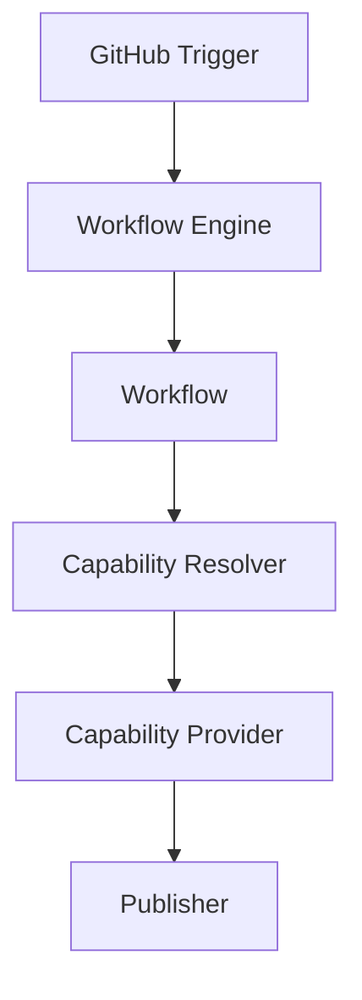

# Runtime Overview

## Mission

Provide a reliable execution platform for AI-assisted software engineering workflows.

## Vision

The Runtime should make AI capabilities operational across the software development lifecycle while keeping workflow logic, provider implementations, infrastructure, policy, context, execution, and publishing concerns separate.

AI providers provide capabilities. The Runtime executes workflows.

## Core Concepts

### Trigger

A trigger is an external event that starts runtime work. The first supported trigger will be GitHub.

### Workflow

A workflow is a product-level process coordinated by the Runtime. The first supported workflow will be Code Review.

### Capability

A capability is an executable implementation of a provider-neutral Action Contract. It receives a fully resolved CapabilityRequest and returns artifacts in a CapabilityResult.

### Provider

A provider implements one or more capabilities. Providers do not know which workflow requested the capability.

### Policy

Policy defines rules that constrain runtime behavior before, during, and after execution.

### Context

Context is the repository, event, and workflow data prepared for a workflow execution.

### Execution

Execution is the deterministic sequential coordination of an ExecutionPlan. The ExecutionEngine resolves bindings, invokes capabilities through execution contracts, stores their artifacts in the ExecutionContext, and returns the plan's declared result.

### Publisher

A publisher delivers workflow results to external systems such as GitHub.

## Component Diagram

## Current Scope

This repository implements deterministic sequential plan execution but intentionally does not implement parallelism, retries, scheduling, provider integrations, GitHub integration, policy logic, execution sandboxing, persistence, telemetry, or publishing behavior.
