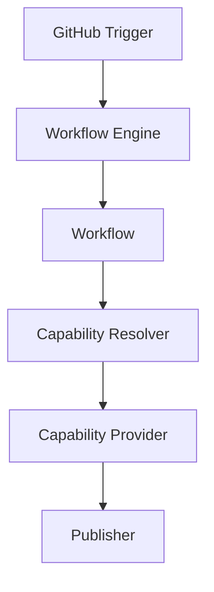

# Runtime Overview

## Mission

Provide a reliable execution platform for AI-assisted software engineering workflows.

## Vision

The Runtime should make AI capabilities operational across the software development lifecycle while keeping workflow logic, provider implementations, infrastructure, policy, context, execution, and publishing concerns separate.

AI providers provide capabilities. The Runtime executes workflows.

## Core Concepts

### Trigger

A trigger is an external event that starts runtime work. The first supported trigger will be GitHub.

### Workflow

A workflow is a product-level process coordinated by the Runtime. The first supported workflow will be Code Review.

### Capability

A Capability defines WHAT provider-neutral transformation may be requested. A
Capability Implementation defines HOW it is performed by transforming input
Artifacts into output Artifacts.

### Provider

A Provider is an optional infrastructure dependency used privately by a
Capability Implementation. Providers are invisible to the Runtime.

### Policy

Policy defines rules that constrain runtime behavior before, during, and after execution.

### Context

Context is the repository, event, and workflow data prepared for a workflow execution.

### Execution

Execution is the deterministic sequential coordination of an ExecutionPlan. The ExecutionEngine resolves bindings, invokes capabilities through execution contracts, stores their artifacts in the ExecutionContext, and returns the plan's declared result.

### Publisher

A publisher delivers immutable Engineering Documents to external systems.
`EngineeringPublisher` is the provider-neutral boundary; the first adapter
publishes Markdown as a GitHub pull-request comment.

## Component Diagram

## Current Scope

This repository implements deterministic sequential plan execution and a
GitHub pull-request comment publishing Capability. It intentionally does not
implement parallelism, retries, scheduling, provider selection, GitHub triggers,
policy logic, execution sandboxing, persistence, or telemetry.
